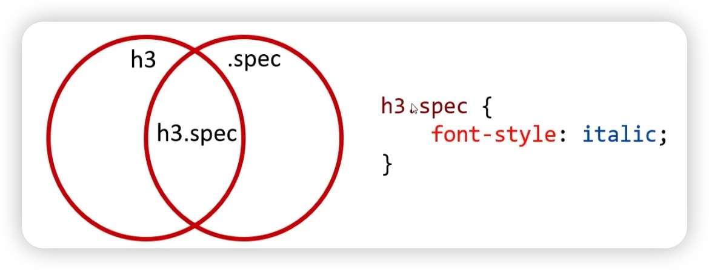
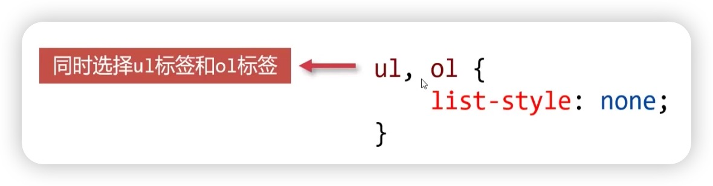
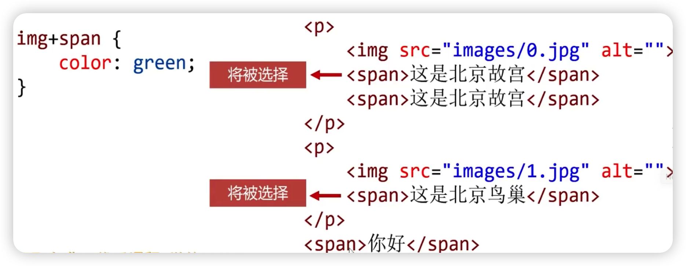

## 复合选择器

### 后代选择器

使用空格组合两个选择器，如果第二个选择器匹配的元素具有与第一个选择器匹配的祖先（父母，父母的父母，父母的父母的父母等）元素，则它们将被选择

```css
selector1 selector2  {
    /* 样式列表*/
}
```


### 交集选择器

使用有`spec`类的 h3 标签，即`h3.spec`



### 并集选择器



## 关系选择器

### 子代关系选择器
使用`>`组合两个 CSS 选择器，它只匹配那些被第二个选择器匹配的元素，是第一个元素的直接子元素

```css
.box>p {
    color: red;
}
```

```html
<div class="box">
    <p>我是段落</p>
    <p>我是段落</p>
    <div>
        <p>我是段落</p>
        <p>我是段落</p>
    <div>
</dev>
<p>我是段落</p>
<p>我是段落</p>
```
只有与 class=“box”的 div 是父子关系的元素才会被选中，即头两个 p 元素将被选择

### 相邻兄弟选择器

使用`+`组合两个选择器，当第二个元素紧跟在第一个元素之后，并且两个元素都是属于同一个父元素的子元素，则第二个元素将被选中



### 通用兄弟选择器

使用`~`组合两个选择器

`p~span` 选择的是 p 元素之后所有同层级的 span 元素