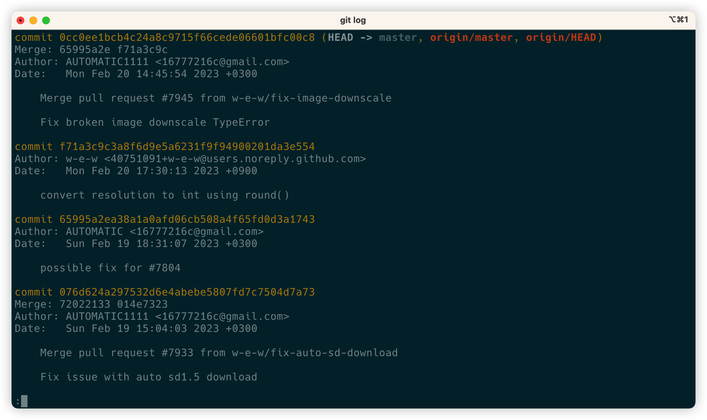
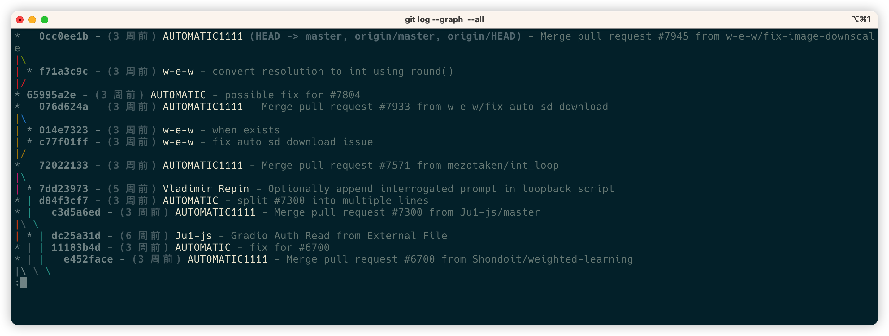

# 使`git log`更加可视化
`git log`本身挺好用的，但默认输出看起来挺单调

可以使用如下命令使输出更加可视化
```bash
git log --graph --format=format:'%C(bold blue)%h%C(reset) - %C(bold green)(%ar)%C(reset) %C(white)%an%C(reset)%C(bold yellow)%d%C(reset) %C(dim white)- %s%C(reset)' --all
```

其中
- `--graph`在输出的左侧绘制基于文本的提交历史图
- `--all`将所有 refs/ 中的引用和 HEAD 一起列在命令行上
- `--format`自定义格式化输出 commit 
- `%C(...)`指定颜色，如`%C(bold green)`表示使用深绿色，`%C(reset)`表示重置颜色设置
- `%h`表示缩写的 commit hash 值，对应的`%H`表示完整版 commit hash 值
- `%ar`表示作者提交至今的相对日期
- `%an`表示作者名字
- `%d`表示引用名称，如上图中的`(HEAD -> master, origin/master, origin/HEAD)`
- `%s`表示 subject，即`git commit -m "xxx"`中的`xxx`

更多选项及设置参见[git-log](https://git-scm.com/docs/git-log)

如果想更方便的使用上述命令，可以将其设置为别名`gitlog`

```bash
alias gitlog="git log --graph --format=format:'%C(bold blue)%h%C(reset) - %C(bold green)(%ar)%C(reset) %C(white)%an%C(reset)%C(bold yellow)%d%C(reset) %C(dim white)- %s%C(reset)' --all"
```
本文主要参考：https://medium.com/gitconnected/use-git-like-a-senior-engineer-ef6d741c898e