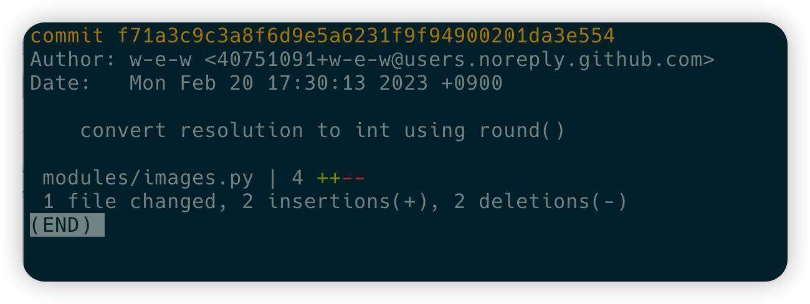
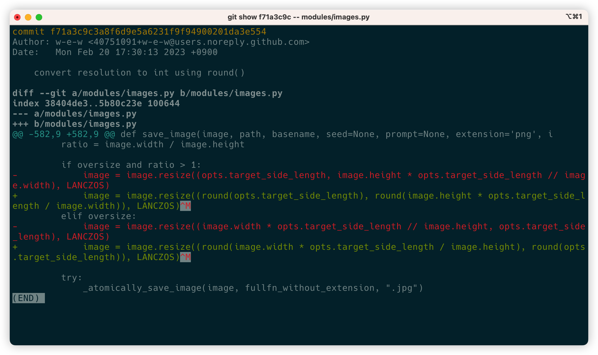

# 使用`git show`检查指定 commit

## 查看指定 commit 的变更总结

```bash
git show <commmit> --stat
```

示例如下

```bash
$ git show f71a3c9c --stat
```

`--stat`会展示所有变更文件的变更总结，如增加几行，删除几行

## 查看指定文件的 commit 变更

```bash
git show <commit> -- <filepath>
```

示例如下

```bash
$ git show f71a3c9c -- modules/images.py
```

会高亮展示变更内容