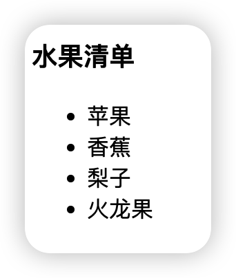
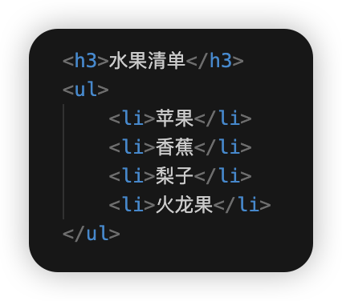
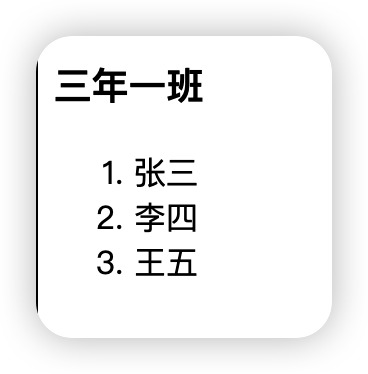
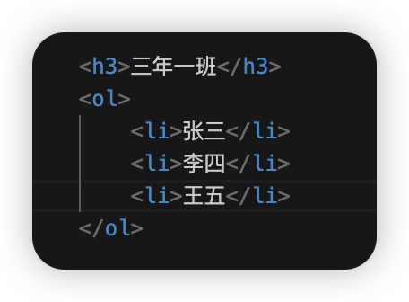
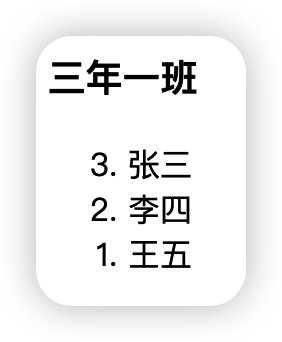
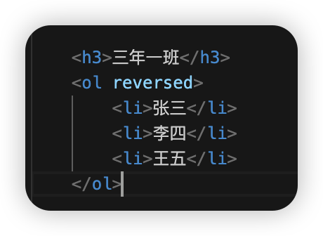
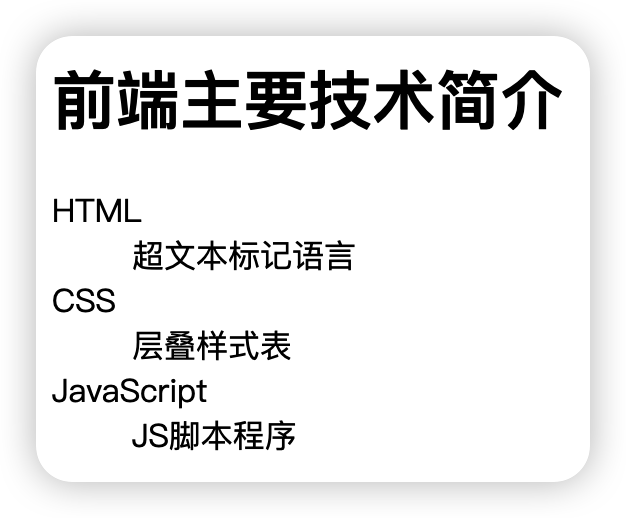
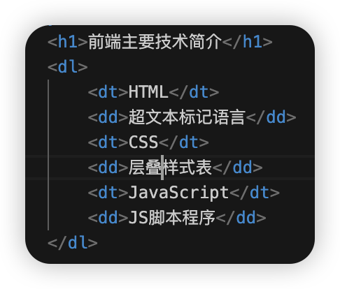
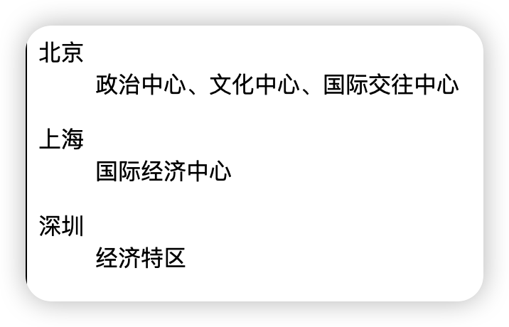
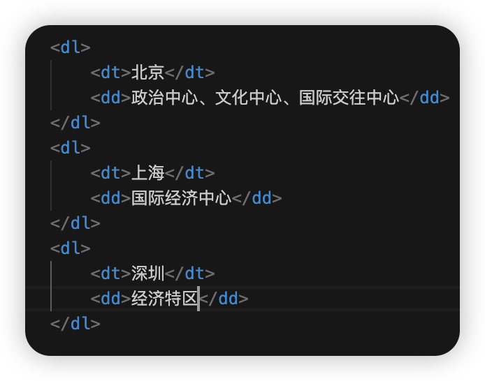

#HTML 
# 列表标签
列表标签共分为三种：
- 无序列表标签
- 有序列表标签
- 定义列表标签
## 无序列表
没有顺序的列表，主要由`<ul></ul>`表示，ul 是`unordered list`的缩写，每一个列表项由`<li></li>`包裹。

如一个水果清单：

### 注意事项
- 无序列表是一个父子组合标签，即`<ul></ul>`与`<li></li>`必须都出现
- `<ul>`的子标签只能是`<li>`，不能是其他标签
- `<li>`标签是容器，内部可以放任何其他标签

## 有序列表
有顺序的列表，主要由`<ol></ol>`表示，ol 是`ordered list`的缩写，每一个列表项由`<li></li>`包裹。

如列举一份成绩排名：

### type 属性
`<ol type="属性值">...`
属性值共有 5 种：
- a: 表示小写英文字母编号
- A：表示大写英文字母编号
- i：表示小写罗马数字编号
- I：表示大写罗马数字编号
- 1：表示数字编号（默认）
### start 属性
`<ol start="xxx">`
属性值必须是一个整数，指定列表项的起始值。如果 type 为`a`，start 为 2，那么起始序号为 b，其他同理。
### reversed 属性
即逆序展示

### 注意事项
- 有序列表是一个父子组合标签，即`<ol></ol>`与`<li></li>`必须都出现
- `<ol>`的子标签只能是`<li>`，不能是其他标签
- `<li>`标签是容器，内部可以放任何其他标签

## 定义列表
需要逐条给出定义解释的列表就是定义列表，定义列表由`<dl></dl>`包裹，dl 即`definition list`的缩写；数据项由`<dt></dt>`包裹，dt 即`data term`的缩写；数据定义由`<dd></dd>`包裹，dd 即`data definition`的缩写。

`dt`与`dd`也可以不用像上边这样交替出现，可以处于不同的定义列表中。

### 什么时候使用定义列表标签

决定标签使用的不是样式，而是语义。只要语义上有解释说明相关的就要使用定义列表标签。

