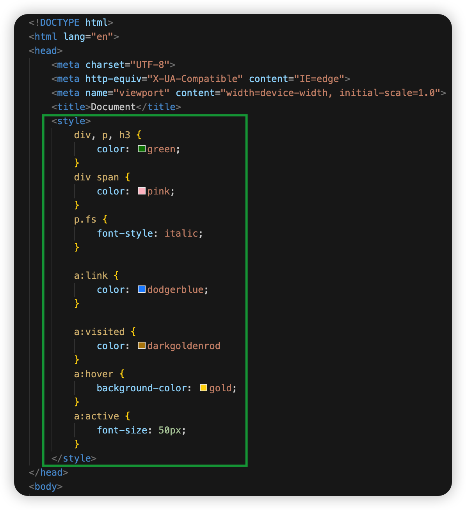

#CSS
# CSS 基础

CSS(cascading style sheet, 层叠式样式表)，用来给 HTML 标签增加样式。

## CSS 如何与 HTML 结合
有了 CSS 后，样式与结构不必杂糅在一起，可以彼此分离。HTML 就负责结构，CSS 就负责样式。

通过选择器，二者结合在一起。

HTML 示例
```html
<body>
    <h2>我是二级标题</h2>
    <p>我是段落</p>
</body>
```
CSS 示例
```css
h2 {
    color: red;
}
p {
    color: blue;
}
```
上面的 h2，p 就是一种选择器（标签选择器），即所有的 h2，p 元素都设置为上面的样式

## CSS 的本质
就是样式的清单列表，选择合适的选择器，然后将指定元素的样式一条一条列出来
## CSS 的书写位置
### 内嵌式
在`<style>`标签中直接写样式



### 外链式

将 CSS 单独存为`.css`文件，然后利用`<link>`标签引入它

`<link  rel="stylesheet" href="css/styles.css">`

外链式的好处是，可以多个 html文件共享同一份 css 样式表

### 导入式
不推荐使用，因为加载网页时不会等样式加载完毕，而会立即渲染 HMTL 结构，所以网页会停顿下才有样式
```html
<style>
    @import url(css/styles.css);
</style>
```

### 行内式

就是利用标签的`style`属性设置样式

`<h2 style="color: red;">我是一个红色的二级标题</h2>`

## CSS 的基本语法

语法：
```
<选择器> {
    <样式名>: <样式值>;
}
```
选择器后跟大括号，大括号里罗列样式设置，样式设置以`k:v`形式存在，没有样式设置后跟`;`，当有多个样式时，最后一个可以不加`;`


```css
h1 {
    color: green;
    font-style: italic;
}
p {
    /* 字体大小 */
    font-size: 20px;
    background-color: orange;
}
```


⚠️注意：CSS 中使用`/*xxx*/`来注释。